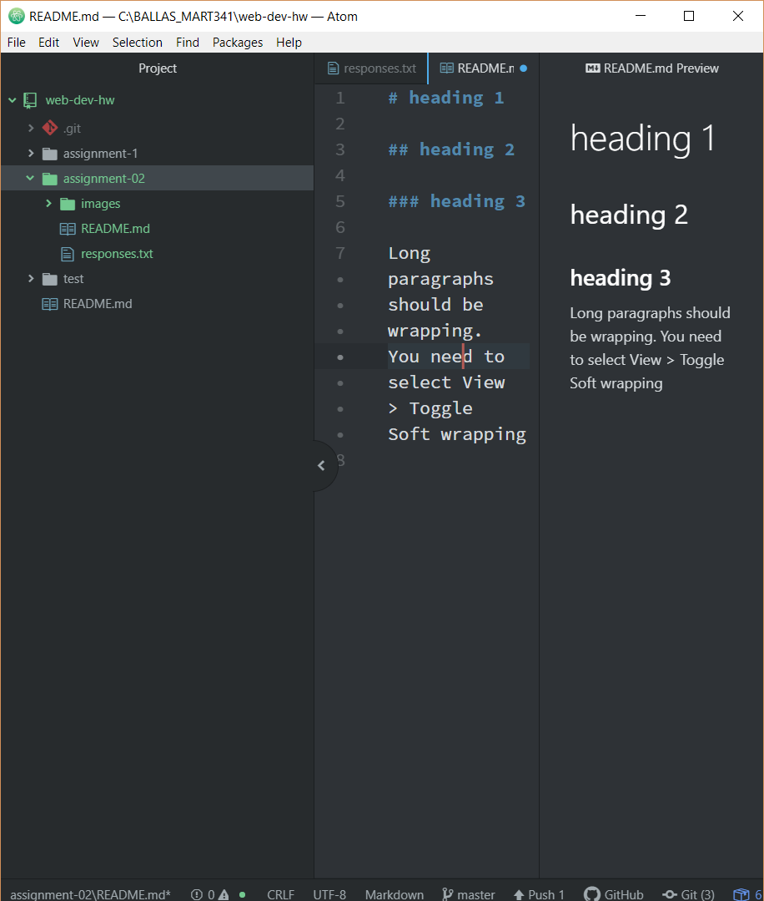

# Assignment 2

## Julia Ballas

MART 340 Intro to Web Design is a required class for a Media Arts Degree, but beyond that, I feel learning to code and understanding web languages is important to my future. I am interested in having the skills to design and maintain my own personal website. I am a self-published author, in addition to attending school. I went back to school after 15 years in order to gain more skills and hopefully start a career as a creative.

Right now I use a Wordpress web manager for my author website, but I get easily frustrated with limitation in their themes. I want to be able to customize it and understand what I'm doing. Or create and maintain my own website. I have a basic knowledge of HTML, but I know very little about CSS or Javascript.

### Goals

1. Learn how to design a fully functional Website
2. Understand CSS better and apply design lessons from other classes
3. Learn more Javascript

[A website I visit frequently using its absolute URL: YouTube](https://www.youtube.com/)

[Assignment 2 Responses](./responses.txt)

