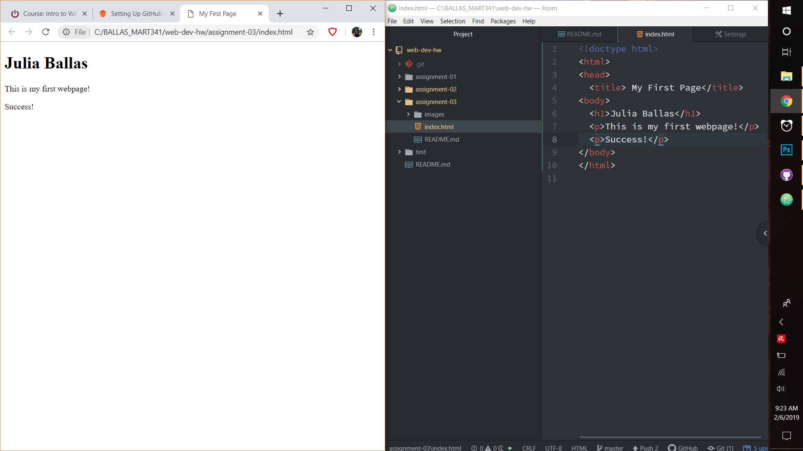

# Assignment 3

## MART341.50

## Julia Ballas

1. Very briefly detail how browsers function. List any browsers you currently use to surf - or even develop for - the web.

A web browser contains a user interface, which gives you access to different webpages through an address bar. When a request is made to go to a certain web page, the browser connetcs through the internet to a server that contains the webpage's documents. Then the browser's rendering engine interprets the HTML and CSS documents so it can display the site. I currently use Google's Chrome, because it loads pages faster.

2. What is a markup language? Describe one commonly used in development.

A markup language is a computer language which displays content beyond just simply text. The most common type of markup is HTML, which uses various elements and tags to display heading sizes, paragraphs of text and even images on a webpage. The tags are interpreted by a web browser and along with a site's CSS, create the visual design of a website.

3. Include your screenshot as an image link.

