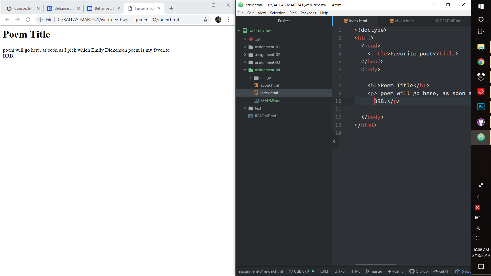

# Julia Ballas

## MART 341.50

## Assignment 04

**1. Visit a site using The Wayback Machine, looking at a snapshot at least 10 years old. Where did you go? What did it look like? How has it changed?**

I visited [nintendo.com](http://www.nintendo.com) in the Wayback Machine. The first record is from 1996, and its visuals rely heavily on their magazine, Nintendo Power. It appears their website changes with every new game systems, from the N64, to the GameCube and then later ones. I have always been a Nintendo fan, so it's fun to see the differences in their old websites.

By 2008, the basic layout is very similar to how it will be ten years later. The 2008 website colors are more white and light blue, like the Wii system they are currently selling. Today their website uses more red and white, like the Switch. Games releases are still the focus on the main page, but I see some similar game franchises, like Pokeman from 2008 and Pokeman games in 2019. It's not surprising, since games are their product.

**2. Summarize your experience with the GIT Module. What did you learn? What was difficult, easy, or still misunderstood?**

Most of the information in the GIT module I was familiar with since I'd learned about the internet and World Wide Web from my MART102 Digital Arts and Technology class last semester. I knew about GITHub.com and was using GITHub Desktop already, since I'd learned about that in my MART120 Creative Coding class. We used markdown in that class as well, so I understood how to write READMEs.

If I had not taken those classes last semester, then this would have been a great review, but I found it a very slow introduction for a coding class. I still do not understand what a DOM is, but I understand that it is vital to displaying or rendering a webpage within your web browser.

I am ready for the HTML module and diving deeper into HTML. After reviewing the source code for the class website I was very intimidated, but excited to be able to recognize some HTML code.

**3. Include your screenshot as an image link.**

