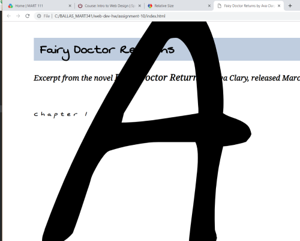

# Julia Ballas

## MART 341.50

## Assignment Week 10 Typography
1. Briefly share your design process for this assignment. What fonts did you choose, and why?

  - NotoSerif-Italic
  - NotoSerif-Regular
  - SwankyandMooMoo

The writing excerpt I choose is from my self-published novel, *Fairy Doctor Returns*. It is a romantic comedy/fantasy set in a modern day London, and the fonts I pick reflex the novel's silly and frivolous style. The main font is NotoSerif, a serif font that is easy to read, but bookish and literary. The secondary font is called "Swanky and Moo Moo", which sounds hilarious and is visually fun and silly.

2. What is the difference between a system font, web font, and web-safe font? What is the importance of having fallback fonts or a font stack?

A system font is a font available on your individual computer. However, a web font is adjusted to display on your browser for a particular website. Web fonts may be downloaded from the websites's server, or stored in another, such as a Google hosted fonts. The web-safe fonts include a short list of fonts that all browers recognize, such as Arial and Times New Roman. It is important to use a backup font, in case the brower isn't able to download the web-font selected in your css document.


## Free Response

### HTML and CSS

This week I choose to focus entirely on typography and only added a little color. I wanted to experiment with padding and spacing and to see if I could overwrite the css elements with classes.

### Coding

I decided to self-host my fonts this time, because embedding is too easy. Then I struggled a bit with the `@font-face`.

### Pseudo-selectors

Initially I started out with one paragraph with all my text, and then used line breaks. This allowed me to use just the `<p>` element to change the `p::first-letter` an `p::first-line`, but I couldn't adjust the rest of the first lines this way. After reviewing the lesson, I follow along with making a main `div` and used the pseudo-selector for the first child. This is still a little confusing to me, but it did fix my problem.

### Padding

After fixing the paragraphs. The next struggle was with the padding. I noticed a major difference between these two codes:
```CSS
html {
  font-family: 'NotoSerif-Regular', serif;
  font-size:16pt;
  letter-spacing: normal;
  padding: 20px 20px 20px 100px;
}
```

vs

```CSS
* {
  font-family: 'NotoSerif-Regular', serif;
  font-size:16pt;
  letter-spacing: normal;
  padding: 20px 20px 20px 100px;
}
```
I was getting a warning from my CSS linter about using the `*{}`. It said that using `*{}` causes slower loading time, but even worse than that using it also effected how my `<cite>` tag appeared, which I did not like. I decided to ultimately stick with the `html{}`

### Font size
I was determined to pick a relative size for my fonts. At first I used %, but then I changed my mind and switched to em. That was a mistake, because I had to go back through carefully to find all of the %. Next time I'll pick one and stick to it.

Although, I had an interesting error switching  between 700% and 70em. It made my dropcap huge!



### Colors
The colors I chose for my link refect Ava Clary's bright pink branding. I really like the contrasting blue/gray, so I may use that in my final project.

As I finished up, and started checking my live website, I noticed the backup font was loading instead of my Noto-Serif font. I had a small typo that was preventing it from appearing. With that fixed. I was satisfied.

### Conclusion

Tyopgraphy is very refreshing. I love being able to adjust my indentation, add indents and line height and letter spacing. This makes the website so much easier to read. Part of me wants to go back and fix my earlier ones.
