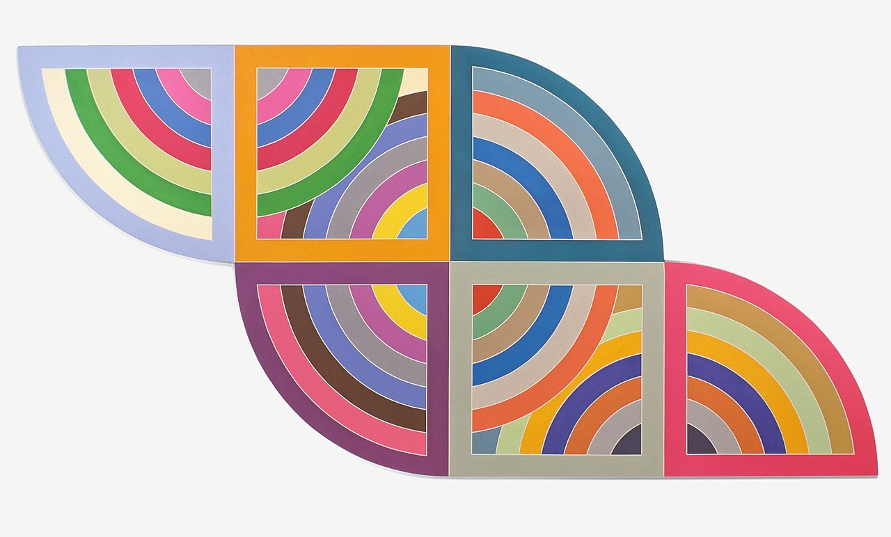
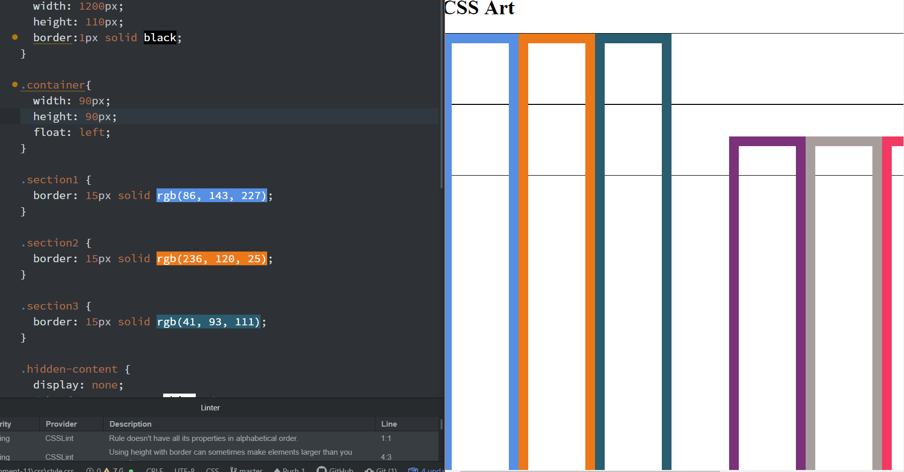
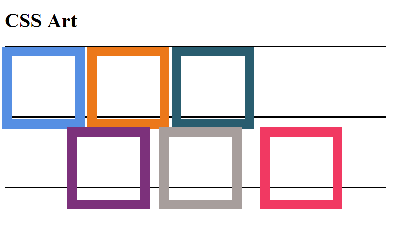

# Julia Ballas

## MART 341.50

## Assignment 11: Positioning

1. What is the difference between padding, margin, and borders?

  - Padding is the space inside the block element
  - Margins are the space outside the block element.
  - Borders is inbetween the margins and padding.


2. Embed the image of the artwork you used as inspiration.

Frank Stella's Harran II


## Free Response

Artwork in CSS is not fun. After studying p5.js last semester I much prefer to use javascript for creating artwork. Even though the math is hard in js, with CSS I felt extremely limited with only controling the position and size and style of my html elements. I also felt like my CSS is very cluttered, with a lot of repeating code, but some of that is color and specific borders for that specific `<div>`. I don't know how to reduce the code. Hopefully, this will come with experience.

### Coding Workflow

I began with the basic layout of my html and css. Then, I created a canvas that was porportional to my artwork inspiration. The original was 10 feet by 20 feet. So I wanted the same dimensions, 600px x 300 px. However, as I began to get deeper into my code I abandoned that precision. I just wanted the same feeling.

I began with boxes. I needed six boxes in 2 rows and three columns. Then I realized I needed 8 "boxes", two of them had to be invisible. I managed the invisible boxes with this code:
```CSS
.hidden-content {
  border: 15px none white;

}
```
As I struggled to get the size and position, once I added an extra zero to make really tall boxes.


Eventually I got my boxes to align by using `display: inline-block` My first attempt was to use `float: left`, but I couldn't get the alignment correct when they floated. I had to use more exact positioning and margin shifting. I used my background canvas to help, but since I was working with borders, and not full boxes all the numbers were incomprehensible. I spent a lot of time just adding 10 more pixels, or 5 more, and then previewing each tiny adjustment.

Here is a screenshot when my boxes were sized correctly, but not in position yet. So close, but not quite there.


Lastly, I added `border-radius: .01px .01px .01px 150px;` to get my rounded shapes.


### Issues or Concerns

The problem with Frank Stella's artwork is all the color. It has a lot of rainbows, or circles and they all overlap. I made an attempt at getting the rainbow, but it was not coming together, so I had to scrape that idea. Since I still needed to have a z-index in my code, I decided to just have a slice of green behind my boxes.

### Conclusion

I feel like I have a much better grasp on positioning and what control I have over the margins and borders of my artwork. I could have spent more time trying to recreate Frank Stella's artwork, but it is so precise. I can't easily do it in CSS. I want to spend more time working on my final project.
