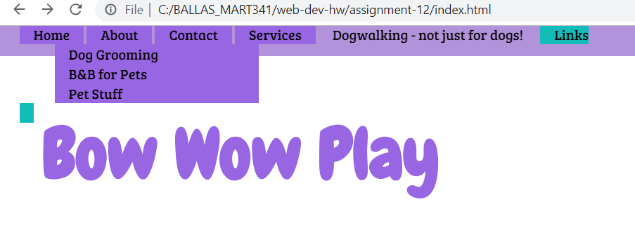

# Julia Ballas

## MART 341.50

## Assignment 12 CSS Website

1. Who was your imaginary client? How did they describe their site needs?

"My company's name is *Bow Wow Play* and we offer *dogwalking services to busy pet owners*. Our brand colors are teal and purple and two words to describe the theme of the website are *frisky* and *outdoors*."


2. What is the difference between display: block, display: inline, and display: inline-block?

  - `display: block` These are elements that line up like blocks, one on top of each other.
  - `display:inline` Elements with this display will line up horizontally.
  - `display:inline-block` This is similar to the 'display:inline', however it also keeps some of the same margins and spacing.

## Free Response

Based on my imaginary client I started brainstorming. They need to showcase their services with lots of photos, so I'm going to feature these in my 'services' page. They'll want to attract people with a clean layout that has some movement to it. That's going to be tricky, adding movement, but I think if I have static pieces them movement makes sense.

### Colors
Teal and purple. I made a color palette on [Color Lovers Palette](https://www.colourlovers.com/palettes/add). Here is the hex and rgb elements.

#12BCB9, rgb(18, 188, 185) - Teal
#12BC89, rgb(18, 188, 137) - Greenish Teal

#9866E2, rgb(152,102,226) - Purple
#B292DB, rgb(178,146,219) - light purple
#AEA4BC, rgb(174, 164, 188) - gray
#C7BCDB, rgb(199,188,219) - grayish purple


### Typography

- Chewy
- Bree Serif

```html
<link href="https://fonts.googleapis.com/css?family=Bree+Serif|Chewy" rel="stylesheet">```

```CSS
@import url('https://fonts.googleapis.com/css?family=Bree+Serif|Chewy');

font-family: 'Chewy', cursive;
font-family: 'Bree Serif', serif;
```

### Coding HTML

I have my basic layout created already, with the meta, and basic html tags. Here's the 5 step plan.

Step 1: basic html layout

Step 2: `<nav>` bar

Step 3: create about, contact, services pages

Step 4: add placeholder text and images

Step 5: add semantics

Step 6: create Contact form elements


### Coding CSS

I want to have a layout with the nav bar, header and footer in color and the main part of the body white. Here is my workflow, also a todo list for thsi project.

Step 1: Add basic CSS padding, margins, etc for body and divs

Step 2: Add colors

Step 3: Add Typography

Step 4: Nav bar, with hover using Pseduo classes and hidden dropdown menu


### Issues or Concerns

I started adding the padding and margins, and realized I didn't like the main layout. I really didn't want a static image in the main section. I wanted a full background image that could adjust sizes. So I'm going to change this.

However, my feature photo idea still did not work, and for a while I couldn't figure out what was wrong. It turns out I had the wrong filepath for my image. I also had to reference the "hero-image" from [W3 schools Background Image ](https://www.w3schools.com/css/css3_backgrounds.asp). This let me get an idea of how to place an image in a `<div>`.

The menu gave me such trouble.

First, somehow I broke my menu. I had it as a `display: inline-block;` and then when I added the background color it stopped displaying as inline-block. Or it was my sizing causing the issue? I'm not sure, but its not working like I wanted it to.


What is this screenshot even showing? The dropdown is over on the right side, and there is an extra little Green from the hover feature. Classy.

Even after changing the size of my header, and messing with display, I still didn't quite get what I was doing here. Once again I relied on [W3 Schools Dropdown Menu tutorials](https://www.w3schools.com/css/css_dropdowns.asp). This let me fix the menu. Ultimately, the dropdown is a long horizontal instead of a vertical bar. But its the best I could do.

The last problem I had was the button on my main page. It was unclickable. I had no idea why. But it turns out my z-index was interferring with the button. So instead of having a z-index on my feature-photo div, I put it on my header and voila. The photo slides under the head like it is supposed to.

### Conclusion

I'm not sure if the CSS website really captured the goal of the project, which was to focus on the theme: frisy and outdoors. The only parts that relates to the theme is the fonts 'Chewy', the green color and the scenes in the photos. I found this project really frustrating, because of the small mistakes I kept making, from breaking my menu to not having the right file path name in my featured photo. I really like having big photos. I will focus on more fluidity with my final project.
