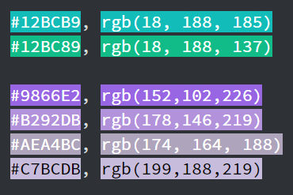

# Julia Ballas

## MART 341.50

## Assignment 12 CSS Website

1. Who was your imaginary client? How did they describe their site needs?

"My company's name is *Bow Wow Play* and we offer *dogwalking services to busy pet owners*. Our brand colors are teal and purple and two words to describe the theme of the website are *frisky* and *outdoors*."


2. What is the difference between display: block, display: inline, and display: inline-block?

- `display: block`
- `display:inline`
- `display:inline-block`

## Free Response

Based on my imaginary client I started brainstorming. They need to showcase their services with photos and videos, so I'm going to feature these in my 'services' page. They'll want to attract people with a clean layout that has some movement to it. That's going to be tricky, adding movement, but I think if I have static pieces them movement makes sense.

### Colors
Teal and purple. I made a color palette on [Color Lovers Palette](https://www.colourlovers.com/palettes/add). Here is the hex and rgb elements.

#12BCB9, rgb(18, 188, 185) - Teal
#12BC89, rgb(18, 188, 137) - Greenish Teal

#9866E2, rgb(152,102,226) - Purple
#B292DB, rgb(178,146,219) - light purple
#AEA4BC, rgb(174, 164, 188) - gray
#C7BCDB, rgb(199,188,219) - grayish purple



### Typography

- Chewy
- Bree Serif

```html
<link href="https://fonts.googleapis.com/css?family=Bree+Serif|Chewy" rel="stylesheet">```

```CSS
@import url('https://fonts.googleapis.com/css?family=Bree+Serif|Chewy');

font-family: 'Chewy', cursive;
font-family: 'Bree Serif', serif;
```

### Placeholder images and text

I found website that let you create [placeholder images](https://fpoimg.com/). You can embed the images too. This one lets you specify placeholder animal images. [Animals placeholder](http://lorempixel.com/)

For generic text I found a [Lorem Ipsum](https://www.lipsum.com/) generator.

For articles I found the [article generator](https://articlegenerator.org/index.php)

Hopefully, that's all I need. Now, on to the coding.

### Coding HTML

I have my basic layout created already, with the meta, and basic html tags. Here's the 5 step plan.

Step 1: basic html layout
Step 2: `<nav>` bar
Step 3: create about, contact, services pages
Step 4: add placeholder text and images
Step 5: add semantics
Step 6: create Contact form elements


### Coding CSS

I want to have a layout with the nav bar, header and footer in color and the main part of the body white. Here is the steps process I'm following. I'll focus on one area and then the next.

Step 1: Add basic CSS padding, margins, etc for body and divs
Step 2: Add colors
Step 3: Add Typography
Step 4: Nav bar, with hover using Pseduo classes and hidden dropdown menu
Step 5: Contact form


### Questions
### Issues or Concerns
### Conclusion
