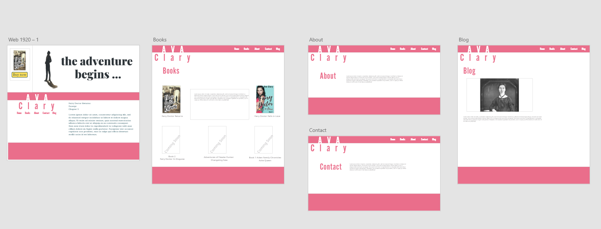
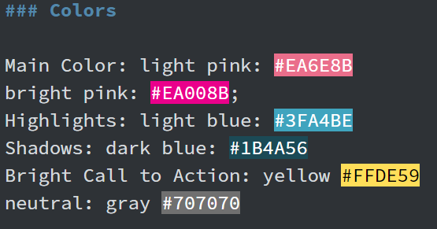
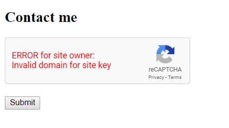
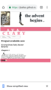
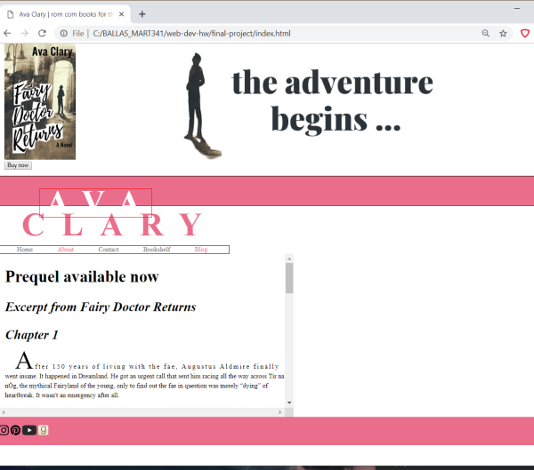
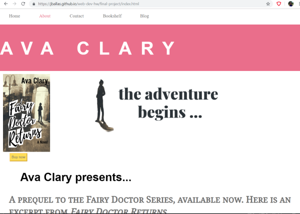

# Julia Ballas

## MART 341.50

## Final Project: Personal Website

1. Did you learn anything new about web development (ie using GitHub, version control, repositories)?

I was already familiar with github from a previous class on coding, so I jumped straight into using a repo and my github desktop. I can't imagine going back to manually uploading files. This semester I accessed my files online and updated them, which is very convineient.

2. Did you learn anything new about web design (ie using media, color, fonts)?

There is so much more to web design than learning your basic html. There is the structural components, but then the actual design is an entirely different thing. I found working from scratch much harder than I expected to get really good looking CSS websites. I will have to keep on practicing to get my ideas to appear in code.

## Free Response
I want my final project to be an author website. The goal of the page is to feature the newest book available and encourage people to buy it, including excerpts and buttons

I have been studying Adobe XD, so I'm going to layout a very rough draft of my page in XD before I begin to code. The tricky part will be recreating what I design in code.



### Colors


Main Color: light pink: #EA6E8B
bright pink: #EA008B;
Highlights: light blue: #3FA4BE
Shadows: dark blue: #1B4A56
Bright Call to Action: yellow #FFDE59
neutral: gray #707070

### Fonts

Main Logo Font: Alternative Gothic No 2 D, sans serif

basic web font: Noto Serif, Serif

### Icons

Instagram, Pinterest, YouTube, Goodreads

### Coding HTML Step-by-Step Plan

- Step 1: basic html layout
- Step 2: create about, contact, book and blog pages
- Step 3: Add basic div and images to each page
- Step 4: Add text
- Step 5: menu bar and footer
- Step 6: create Contact form elements

This wasn't hard to put together. I used some of content from my wordpress website, but I made sure to recreate the code from scratch and not just copy and paste. After I get my layout and content, then I have to work on the CSS.

### Coding CSS

- Step 1: Focus on adding css to index.html; working from the top of the page downward. Header, main section and footer.
  - 1.2: Book
  - 1.3: blog
  - 1.4: About
  - 1.5: Contact
- Step 2: Fix Typography, sizing
- Step 3: Nav bar updated, with hover using Pseduo classes
- Step 4: Contact form and button design

My workflow was much better this time around, instead of focusing on an element, such as color or typography, I allowed myself to focus on each page and started at the top and went down. I tend to bounce around when I code, from adding code to margins and padding, but focusing like this helped so much.

After my issue with the responsive design I simplified my layout and my banner from my original idea and I'm much happier. This way the content stands out and I can use images or artwork to make it more colorful. Keeping with a very simple color palette really makes sense to me now.

### Issues or Concerns

#### Recaptcha from Google
I wanted to impliment a recaptcha in my contact form. So I researched Google's recaptcha and applied for a key for the website and added in a code. I'm not sure I implimented it correctly. 

Script added inside the `<head>`
```HTML
<!-- Google Recaptcha Script from https://developers.google.com/recaptcha/docs/display -->
<script src="https://www.google.com/recaptcha/api.js" async defer></script>
```

Added this form to the `<body>` and a personalized sitekey from google.
```html
<form action="?" method="POST">
      <div class="g-recaptcha" data-sitekey="6LdataAUAAAAAHkIYpPo585VwuKMlanM8FfkkwAe"></div>
      <br/>
      <input type="submit" value="Submit">
    </form>
```

It turns out it does work correctly online, but I get an error on my local version. That is okay by me.

#### Responsive design
I was working along on my layout, following my lovely XD prototype, then I tested it on my mobile and discovered a huge problem. My site was not responsive.

Mobile


Website


I decided to make some changes and simplified my layout, moved the location of my menu and various other things. However, when I tested again I found the same problem. Then I discovered the missing " . That was the problem. In my `<meta>` tag I was missing a " and that made the site non-responsive. Simple fix, yet so very very important. Testing is key to making sure everything is working. I will test again with the correct meta tag.

It works much better. I still had to adjust my font sizes and image sizes to be more repsonsive. Ultimately, I am very satisfied with layout on mobile and on web.


### Conclusion

Final Website


HTML and CSS combine to make a beautiful code. The experience of learning basic html to designing more complex websites has been an amazing journey this semester, one I plan to continue. There is something very satisfying about struggling with your code and then finally seeing it come together in the end.
